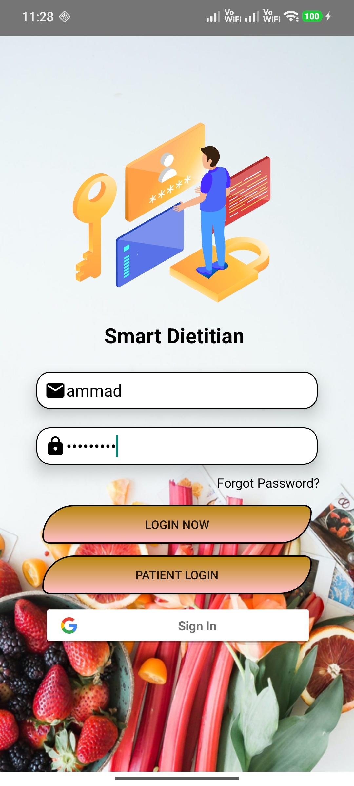
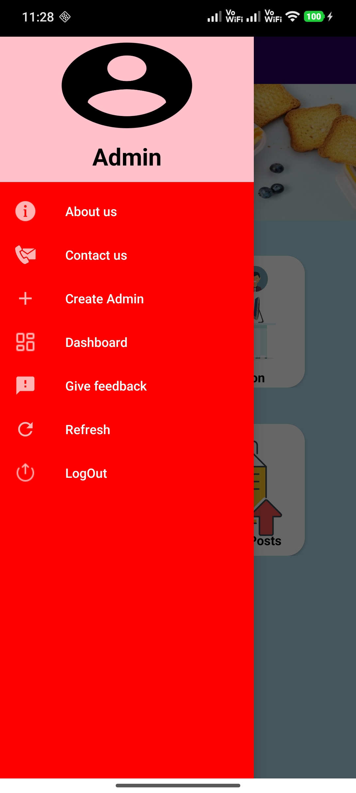
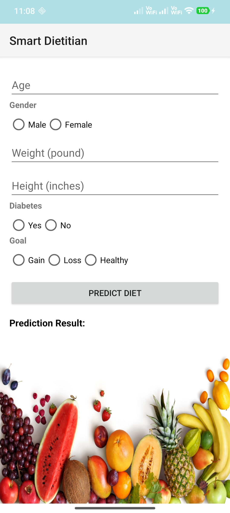
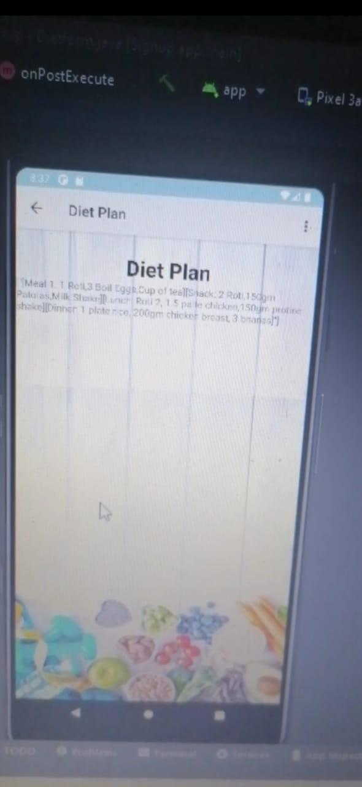
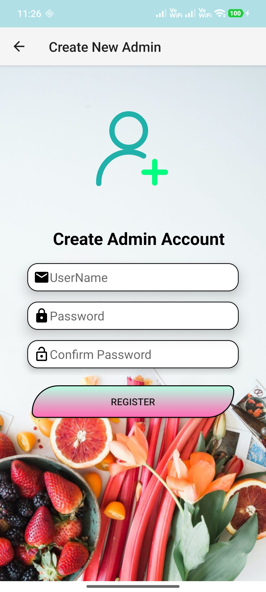
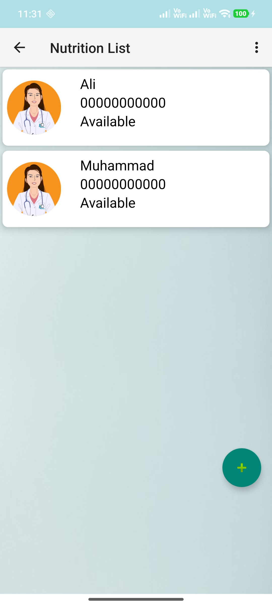
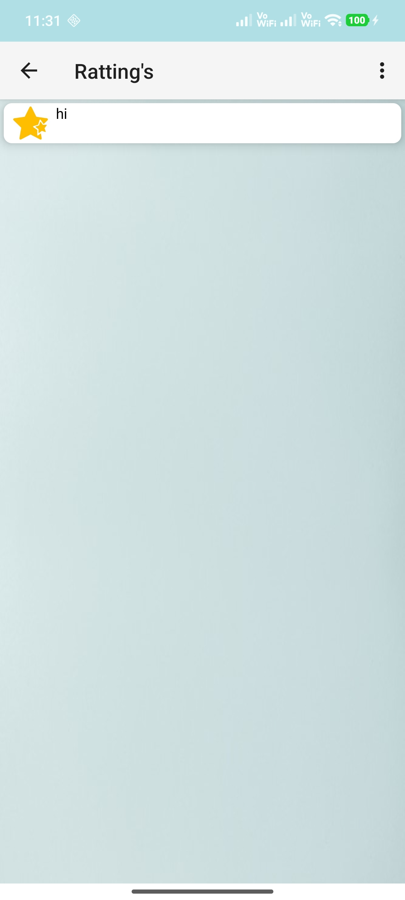

# Smart-Ai-Diet-Consultant
Smart AI Diet Consultant(FYP Project) Android Application | AI-based Diet Recommendation Developed an Android application that provides AI-based personalized diet plans Collected user details such as body type, weight, height, lifestyle, and health conditions Generated diet plans for weight loss, weight gain, and healthy living goals.Multiple ML models (SVM, KNN, and Random Forest) were tested, with Random Forest achieving the best accuracy for diet recommendations. then sends this data to a Flask REST API. The API processes the input using an AI model and returns personalized diet plans. OkHttp3 library was used to handle secure HTTP requests and fetch AI responses efficiently. Implemented user authentication with login and registration functionality Integrated admin and nutritionist support for expert guidance Enabled users to view updated diet-related posts and recommendations.
 
### Login & Signup
User can create an account using email and password. Validation ensures:

Email format correct and not already registered
Password minimum 8 characters with letters & numbers
 

 
### User Dashboard
Once logged in, user sees:

Personal diet plan and AI recommendations
Diet history and nutrition
Healthy posts, daily meals, and profile management
Feedback submission and interactive diet forms
 

 
### Admin Dashboard
Admin can manage users and app content:

user diet history
Add or delete nutrition info
Create healthy posts and announcements
View feedback from users
 

 

